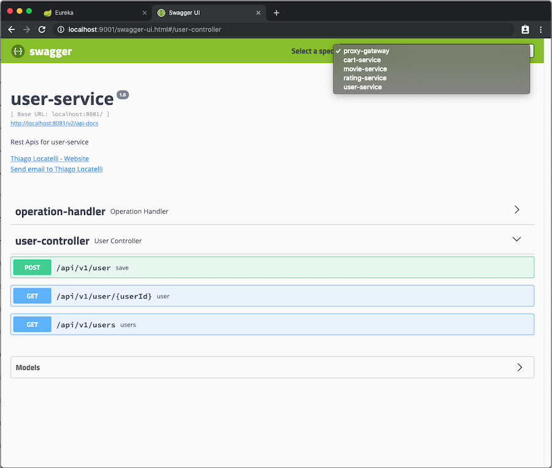

# Spring Cloud Playgroud - Simple Movie Experience


## Micro Services

### user-service (port 8081)

| API                       | HTTP Method   |  Description |
|---------------------------|---------------|--------------|
| /api/v1/user              | POST          |  Creates or updates an user |
| /api/v1/user/{userId}     | GET           |  Retrieves an user object |
| /api/v1/users             | GET           |  Retrieves the list of users |


### movie-service (port 8082)

| API                       | HTTP Method   |  Description |
|---------------------------|---------------|--------------|
| /api/v1/movie             | POST          |  Creates or updates a movie |
| /api/v1/movie/{movieId}   | GET           |  Retrieves a movie object |
| /api/v1/movies            | GET           |  Retrieves the list of movies |


### rating-service (port 8083)

| API                                   | HTTP Method   |  Description |
|---------------------------------------|---------------|--------------|
| /api/v1/rating                        | POST          |  Creates a movie rating |
| /api/v1/ratings/user/{userId}         | GET           |  Retrieves the list of ratings for an user |
| /api/v1/ratings/movies/{movieId}      | GET           |  Retrieves the list of ratings for a movie |
| /api/v1/ratings/{userId}/{movieId}    | GET           |  Retrieves a rating for an user and movie |
| /api/v1/ratings/{userId}/{movieId}    | DELETE        |  Deletes a rating for an user and movie |


### cart-service (port 8084)

| API                               | HTTP Method   |  Description |
|-----------------------------------|---------------|--------------|
| /api/v1/cart                      | POST          |  Creates a cart item |
| /api/v1/cart/{userId}             | GET           |  Retrieves the list of cart items for an user |
| /api/v1/cart/{userId}/{movieId}   | DELETE        |  Deletes a cart item for an user and movie |


## Cloud Services

### Portainer (port 9999)

### Discovery Server - Eureka (port 8888)


### Proxy Gateway - Zuul Proxy (port 9001)



### Api Gateway - Spring Cloud Gateway (port 9000)

The api gateway uses spring-cloud-gateway, which behinds the scenes is suing spring webflux. At the moment
spring webflux does not support the swagger-ui. Below you can see example of requests going through the api
gateway:

```
[skydiver@dropzone ~/spring-cloud-playground (master)] curl --header "Content-Type: application/json" --request POST --data '{ "firstName": "Thiago", "lastName": "Locatelli", "username": "thiagolocatelli"}' http://localhost:9000/user-service/api/v1/user
[skydiver@dropzone ~/spring-cloud-playground (master)] curl --header "Content-Type: application/json" --request POST --data '{ "firstName": "Josh", "lastName": "Long", "username": "starbuxman"}' http://localhost:9000/user-service/api/v1/user
[skydiver@dropzone ~/spring-cloud-playground (master)] curl --header "Content-Type: application/json" --request POST --data '{ "firstName": "Mark", "lastName": "Heckler", "username": "mkheck"}' http://localhost:9000/user-service/api/v1/user

[skydiver@dropzone ~/spring-cloud-playground (master)] http http://localhost:9000/user-service/api/v1/users
HTTP/1.1 200
Content-Type: application/json;charset=UTF-8
Date: Thu, 09 May 2019 19:05:59 GMT
Transfer-Encoding: chunked

[
    {
        "firstName": "Thiago",
        "id": 1,
        "lastName": "Locatelli"
    },
    {
        "firstName": "Josh",
        "id": 2,
        "lastName": "Long"
    },
    {
        "firstName": "Mark",
        "id": 3,
        "lastName": "Heckler"
    }
]
```

## Working with it

### Downloading and running localy

### Deploying to Docker

### Deploying to Docker Swarm